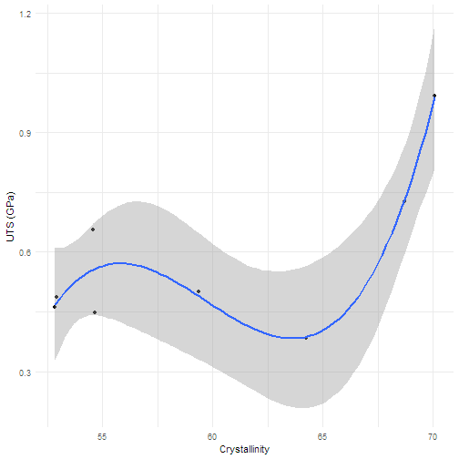

## Anneal Regression
I was able to get a very good fit using am multiple regression model. High correlation, low p value, and very good "goodness of fit" stats, indicating that the data was not over fit. 


```r
anneal.UTS <- lm(UTS_FTIR ~ wamor_or + wcryst_or + tot_or, data = min.anneal)
summary(multiUTS)
```

```
## 
## Call:
## lm(formula = UTS_FTIR ~ poly(Perc_Cryst, 3, raw = TRUE), data = min.quench)
## 
## Residuals:
##       633       956      1279      1565      1973      2435      2632 
## -0.110073 -0.008719  0.012468  0.100013 -0.003493  0.002235 -0.002216 
##      2791 
##  0.009783 
## 
## Coefficients:
##                                    Estimate Std. Error t value Pr(>|t|)  
## (Intercept)                      -1.671e+02  5.580e+01  -2.994   0.0402 *
## poly(Perc_Cryst, 3, raw = TRUE)1  8.492e+00  2.756e+00   3.082   0.0369 *
## poly(Perc_Cryst, 3, raw = TRUE)2 -1.428e-01  4.513e-02  -3.165   0.0340 *
## poly(Perc_Cryst, 3, raw = TRUE)3  7.974e-04  2.452e-04   3.252   0.0313 *
## ---
## Signif. codes:  0 '***' 0.001 '**' 0.01 '*' 0.05 '.' 0.1 ' ' 1
## 
## Residual standard error: 0.07495 on 4 degrees of freedom
## Multiple R-squared:  0.9204,	Adjusted R-squared:  0.8607 
## F-statistic: 15.42 on 3 and 4 DF,  p-value: 0.01155
```

```r
model_fit_stats(multiUTS)
```

```
##   r.squared adj.r.squared pred.r.squared      press      AIC      BIC
## 1  0.920423     0.8607402      0.8304482 0.04787185 -14.2978 -13.9006
```

## Quench Regression
I could not get the same model to work with the quench data. However, I got a different model that works quite well, and is also suggested by the data. Here I use a 3rd degree polynomial, but it looks like once we increase our sample size, a second degree will fit nicely. Like before, the model has a high predictive value, and does not seem to be over fit based on both the eye test and the fit stats




```r
multiUTS <- lm(UTS_FTIR ~ poly(Perc_Cryst , 3, raw = TRUE), data = min.quench)
summary(multiUTS)
```

```
## 
## Call:
## lm(formula = UTS_FTIR ~ poly(Perc_Cryst, 3, raw = TRUE), data = min.quench)
## 
## Residuals:
##       633       956      1279      1565      1973      2435      2632 
## -0.110073 -0.008719  0.012468  0.100013 -0.003493  0.002235 -0.002216 
##      2791 
##  0.009783 
## 
## Coefficients:
##                                    Estimate Std. Error t value Pr(>|t|)  
## (Intercept)                      -1.671e+02  5.580e+01  -2.994   0.0402 *
## poly(Perc_Cryst, 3, raw = TRUE)1  8.492e+00  2.756e+00   3.082   0.0369 *
## poly(Perc_Cryst, 3, raw = TRUE)2 -1.428e-01  4.513e-02  -3.165   0.0340 *
## poly(Perc_Cryst, 3, raw = TRUE)3  7.974e-04  2.452e-04   3.252   0.0313 *
## ---
## Signif. codes:  0 '***' 0.001 '**' 0.01 '*' 0.05 '.' 0.1 ' ' 1
## 
## Residual standard error: 0.07495 on 4 degrees of freedom
## Multiple R-squared:  0.9204,	Adjusted R-squared:  0.8607 
## F-statistic: 15.42 on 3 and 4 DF,  p-value: 0.01155
```

```r
model_fit_stats(multiUTS)
```

```
##   r.squared adj.r.squared pred.r.squared      press      AIC      BIC
## 1  0.920423     0.8607402      0.8304482 0.04787185 -14.2978 -13.9006
```

## PCA of Anneal and Quench
In order to determine whether the Quench and Anneal samples differ in some way, I decided to perform PCA on them to determine if they are really distinct populations of fibers. That is to say, an annealed fiber is different than a quenched fiber. 


```r
pca.all.df  <- prcomp(pca.all, scale = TRUE, center = TRUE)
```


```
## png 
##   2
```


## Stress Strain Curves

In order to visualize the changes in strength as a function of temperatire, I have arranged the stress strain curves and thier derivitivesside by side according to the temperature they were treated. 

### Anneal


```
## TableGrob (2 x 1) "arrange": 2 grobs
##   z     cells    name           grob
## 1 1 (1-1,1-1) arrange gtable[layout]
## 2 2 (2-2,1-1) arrange gtable[layout]
```

```
## png 
##   2
```


### Quench


```
## png 
##   2
```


